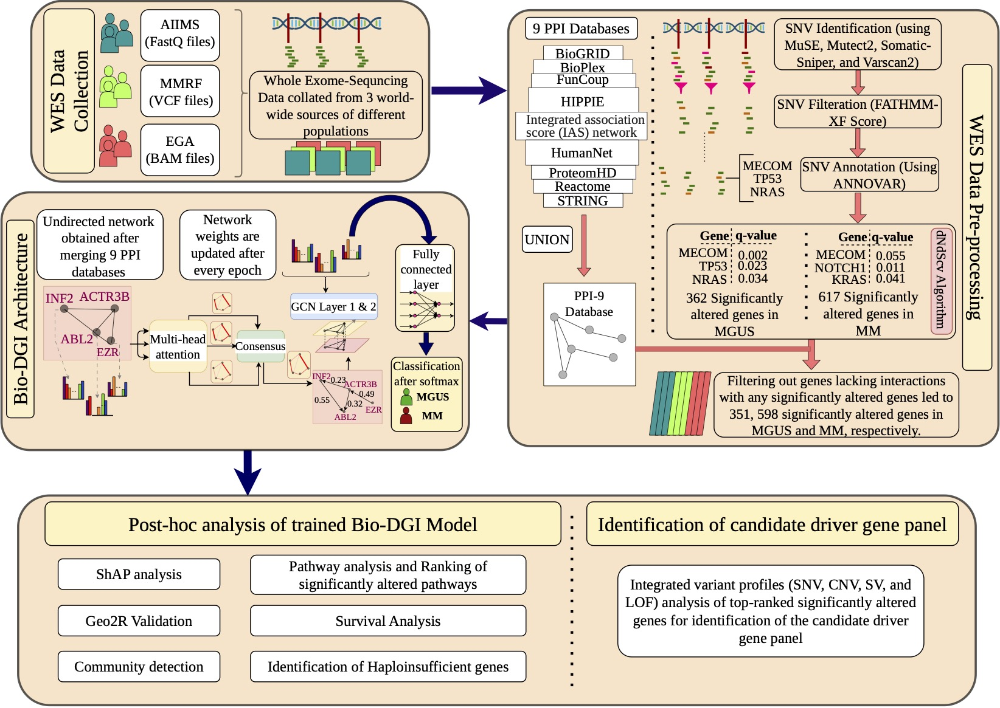

# BIO-DGI

*Figure: Infographic representation of proposed AI-based bio-inspired BIO-DGI model and post-hoc analysis for identifying pivotal genomic biomarkers that can distinguish MM from MGUS. In the proposed AI-based workflow, the BAM files sourced from EGA and AIIMS datasets, along with VCF files from the MMRF dataset, undergo processing to identify 798 significantly altered genes utilizing the dndscv tool (as illustrated in the WES Data pre-processing block). Subsequently, interactions among these 798 genes are elucidated employing PPI networks from nine PPI databases (BioGRID, BioPlex, FunCoup, HIPPIE, IAS network, HumanNet, ProteomHD, Reactome, and STRING). A network is constructed with nodes representing the significantly altered genes and edges denoting interactions obtained after merging interactions from the nine above-mentioned PPI databases. Each node has 26 genomic features specific to its corresponding gene. The architecture of the BIO-DGI model contains a multi-head attention unit and a GCN layer followed by a fully connected layer. The feature matrix and adjacency matrix are provided as input to the BIO-DGI model. The multi-head attention unit in the BIO-DGI model updates the weights of gene interactions in the adjacency matrix, which are then integrated with the sample feature matrix to gain insights on distinguishing biomarkers that can differentiate MM from MGUS. The output of the fully connected layer is converted into the classification probabilities using the softmax activation function. Consequently, the WES data of each subject is analyzed, and feature vectors for all 798 genes are derived. These feature vectors, in conjunction with the subject MM/MGUS target class label, constitute the input for supervised training of the GCN. Following learning the BIO-DGI model for distinguishing MGUS from MM, the top genomic features and significantly altered signalling pathways are extracted utilizing the ShAP algorithm and cross-referencing with the Enrichr pathway database.*

# Reference
Ruhela, V., Oberoi, R., Gupta, R. and Gupta, A., 2023. A Comprehensive Targeted Panel of 295 Genes: Unveiling Key Disease Initiating and Transformative Biomarkers in Multiple Myeloma. bioRxiv, pp.2023-10.
